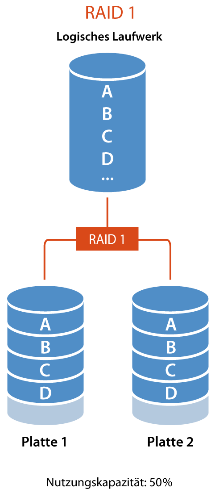
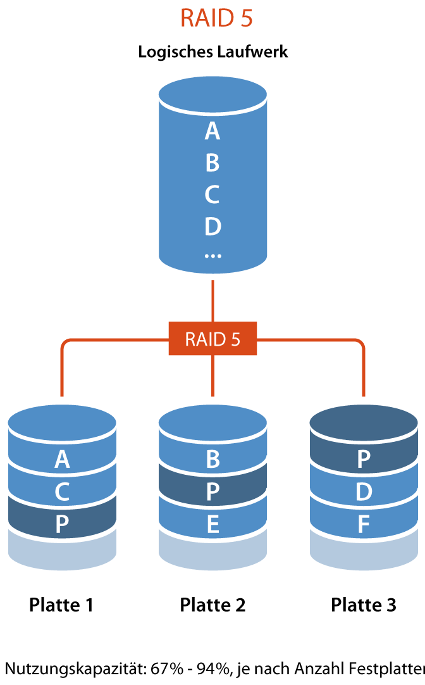
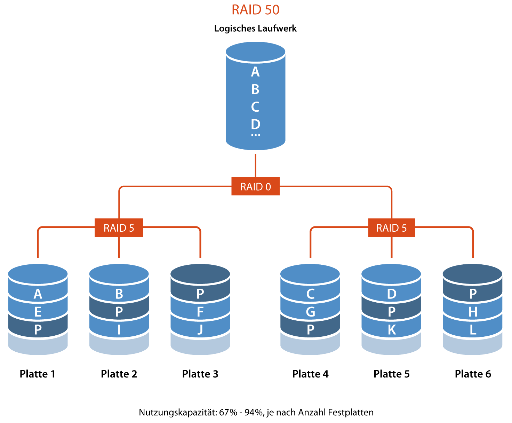

# :material-harddisk: RAID-Systeme

## Was ist RAID?
RAID (***R***edundant ***A***rray of ***I***ndependent ***D***isks) ist eine Technologie zur **Verbesserung der Leistung, Zuverlässigkeit und Zugänglichkeit von Datenspeicher**. Dabei werden mehrere physische Festplatten zu einer virtuellen logischen Einheit zusammengefasst, wodurch eine höhere Ausfallsicherheit oder ein größerer Datendurchsatz als bei einem einzelnen physischem Speichermedium erreicht wird.

## Entstehung
Das RAID-System wurde 1987 von David A. Patterson, Garth A. Gibson und Randy H. Katz an der University of California, Berkeley, USA, eingeführt. Ursprünglich stand RAID für “***R***edundant ***A***rray of ***I***nexpensive ***D***isks”. Die Idee war, Daten auf vielen kleineren, preisgünstigen Festplatten zu speichern, um die Kosten für eine große, teure Festplatte zu sparen und die Leistung zu verbessern.

Die Autoren stellten verschiedene RAID-Level vor, um das gestiegene Ausfallrisiko im Verbund durch redundante Datenspeicherung zu begegnen. Später wurden die Varianten [RAID 0](#raid-0) und [RAID 6](#raid-6) von der Industrie hinzugefügt. Seit 1992 erfolgt eine Standardisierung durch das **RAID Advisory Board**.

Mit der Zeit wurde das RAID-Konzept zunehmend in Serveranwendungen eingesetzt, um den erhöhten Datendurchsatz und die Ausfallsicherheit zu nutzen. Daher änderte sich die Bedeutung von RAID zu “Redundant Array of Independent Disks”. Die Kostenersparnis war nicht mehr der Hauptfokus. Heute ermöglichen RAID-Systeme den Austausch einzelner Festplatten im laufenden Betrieb.

### Speicherungstechniken

#### Spiegelung:
Bei der Spiegelung (engl. **Mirroring**) wird ein Datensatz «AB» komplett auf zwei verschiedenen Festplatten abgespeichert. Beim **Ausfall einer Platte gehen keine Informationen verloren**, da der ganze Datensatz auch auf der zweiten Platte vorhanden ist.

#### Streifen:
Beim Streifen (engl. **Striping**) wird ein Datensatz «AB» aufgeteilt und auf mehrere aufeinanderfolgende Festplatten gespeichert. Beim **Ausfall einer Platte sind alle Informationen verloren**, da sämtliche Platten benötigt werden um den Datensatz vollständig lesen zu können.
Mit Streifen wird die **Lese- und Schreibgeschwindigkeit erhöht**, da von mehreren Festplatten gleichzeitig gelesen werden kann.

#### Parität:
Parität (engl. **Parity**) ergänzt jeden Streifen mit der Möglichkeit in einen Datensatz verlorene Informationen wiederherzustellen. Ein Datensatz «AB» wird mit Streifen auf mehrere Platten verteilt. Auf einer zusätzlichen Platte wird für jeden Streifen ein Paritätswert «P» errechnet. **Fällt eine Platte aus, kann mit Hilfe der Parität die fehlende Information errechnet werden**.

**Ein vereinfachtes Beispiel**: Sie speichern auf zwei Festplatten je eine Zahl: 4 und 7. Auf der dritten Paritäsplatte speichern Sie die Summe der beiden Zahlen: 11. Fällt eine der beiden Platten aus, können Sie mit Hilfe der Summe die fehlende Zahl berechnen.

## Beispiele für RAID 0, 1 und 5
Die gebräuchlichsten RAID Level sind die RAID Level 0, 1 und 5.

Bei der Präsenz von drei Platten à 1 TB, die jeweils eine Ausfallwahrscheinlichkeit von 1 % in einem gegebenen Zeitraum haben, gilt

- [RAID 0](#raid-0) stellt 3 TB zur Verfügung. Die Ausfallwahrscheinlichkeit des RAIDs beträgt 2,9701 % (1 in 34 Fällen).
- [RAID 1](#raid-1) stellt 1 TB zur Verfügung. Die Ausfallwahrscheinlichkeit des RAIDs beträgt 0,0001 % (1 in 1.000.000 Fällen).
- [RAID 5](#raid-5) stellt 2 TB zur Verfügung. Die Ausfallwahrscheinlichkeit des RAIDs beträgt 0,0298 % (1 in 3.356 Fällen).

## Raid Level

### RAID 0 ([Striping](#streifen))
#### Beschreibung 

!!! image inline end "Veranschaulichung"

    

[RAID 0](#raid-0), auch bekannt als “Array of Independent Disks”, erhöht die Transferraten durch parallele Zugriffe auf alle beteiligten Festplatten. Die Daten werden in zusammenhängende Blöcke gleicher Größe aufgeteilt und quasi im Reißverschlussverfahren angeordnet ([Striping](#streifen)). Bei einem Defekt einer Festplatte können die Nutzdaten jedoch nicht mehr vollständig rekonstruiert werden, was zu einem vollständigen Datenverlust führen kann. Daher ist [RAID 0](#raid-0) nur in Anwendungen zu empfehlen, bei denen Ausfallsicherheit nicht von Bedeutung ist. Eine Sonderform ist der Hybrid-RAID-0-Verbund aus SSD und konventioneller Festplatte, bei dem die SSD als großer Cachespeicher dient. Hier entsteht jedoch kein echtes [RAID 0](#raid-0), da die Daten beider Datenträger auch separat noch lesbar sind.

#### Speicherungstechnik 
- [Striping](#streifen)

#### Anwendungsfälle
- Laufwerk für Datenbankserver

#### Vorteile
- Hohe Leistung durch parallelen Zugriff auf mehrere Laufwerke
- Keine Redundanz, daher maximale Speicherkapazität

#### Nachteile
- Keine Ausfallsicherheit – ein Laufwerksausfall führt zum Datenverlust

???+ warning "tl;dr"
    Wenn eine der Festplatten ausfällt, kann der RAID-Controller die Nutzdaten nicht mehr vollständig rekonstruieren. [RAID 0](#raid-0) eignet sich daher nur für Anwendungen, bei denen Ausfallsicherheit keine Rolle spielt.

### RAID 1 ([Mirroring](#spiegelung))
#### Beschreibung 

!!! image inline end "Veranschaulichung"

    

[RAID 1](#raid-1) ist ein Verbund von mindestens zwei Festplatten, die die gleichen Daten speichern, was volle Redundanz bietet. Es ist einfach zu implementieren und bietet eine hohe Ausfallsicherheit. Bei einem Ausfall einer Platte können die anderen weiterhin alle Daten liefern.

Es gibt Unterschiede zwischen [Mirroring](#spiegelung) (alle Festplatten am selben Controller) und Duplexing (jede Festplatte hat einen eigenen Controller), die heute hauptsächlich in Bezug auf den Single Point of Failure[^1] relevant sind.

[RAID 1](#raid-1) kann die Leseleistung erhöhen, indem es auf mehr als eine Festplatte zugreift und verschiedene Sektoren von verschiedenen Platten gleichzeitig einliest. Dies erhöht die Lesegeschwindigkeit, geht aber auf Kosten der Sicherheit.

Zur Erhöhung der Sicherheit kann [RAID 1](#raid-1) beim Lesen stets auf mehr als eine Festplatte zugreifen und die Antwortdatenströme der Festplatten vergleichen. Bei Unstimmigkeiten wird eine Fehlermeldung ausgegeben.

Eine Spiegelplatte ersetzt jedoch keine Datensicherung, da versehentliche oder fehlerhafte Schreiboperationen sofort auf die Spiegelplatte übertragen werden.

Eine Sonderform ist ein Hybrid-RAID-1-Verbund aus SSD und konventioneller Festplatte, der die Vorteile einer SSD (Lesegeschwindigkeit) mit der Redundanz verbindet.
    

#### Speicherungstechnik 
- Mirroring

#### Anwendungsfälle
- Laufwerk für das Betriebssystem

#### Vorteile
- Hohe Ausfallsicherheit – Daten bleiben erhalten, wenn ein Laufwerk ausfällt
- Geringe Schreiblatenz

#### Nachteile
- Hohe Kosten (doppelter Speicherbedarf)
- Tiefe Nutzungskapazität[^3]
- Langsame Schreibgeschwindigkeit

### RAID 5
#### Beschreibung

!!! image inline end "Veranschaulichung"

    

[RAID 5](#raid-5) verwendet eine Methode namens [Striping](#streifen) mit verteilter [Parität](#parität) auf Blockebene. Bei neueren RAID-Implementierungen wird die neue Paritätsinformation[^2] bei einem Schreibzugriff durch XOR-Verknüpfung von altem und neuen Datenwert sowie des alten Paritätswerts berechnet. Dies erlaubt den Aufbau von größeren RAID-5-Arrays ohne Leistungsabfall.

Die Datenintegrität des Arrays ist beim Ausfall von maximal einer Platte gewährleistet. Während des Rebuilds auf die Hotspare-Platte oder nach Austausch der defekten Festplatte lässt die Leistung deutlich nach.

Eine Methode zur Verbesserung der Rebuild-Leistung und damit der Ausfallsicherheit ist präemptives [RAID 5](#raid-5). Hierbei werden interne Fehlerkorrekturstatistiken der Festplatten zur Vorhersage eines Ausfalls herangezogen.

Die Anzahl der Festplatten in RAID-5-Systemen hat einen Einfluss auf die Schreibleistung. Die Leseleistung wird weitestgehend durch die Anzahl der Festplatten und die Cache-Größen bestimmt. Die Bestimmung der Schreibleistung bei [RAID 5](#raid-5) ist komplizierter und hängt sowohl von der zu schreibenden Datenmenge als auch von der Anzahl der Platten ab.

#### Speicherungstechnik
- [Striping](#streifen) mit verteilter [Parität](#parität)

#### Anwendungsfälle
- Laufwerke für Archivsysteme

#### Vorteile
- Gute Leistung und Ausfallsicherheit
- Effiziente Nutzung des Speicherplatzes

#### Nachteile
- Komplexere Verwaltung
- Schreiblatenz durch Paritätsberechnungen (Langsame Schreibgeschwindigkeit)

!!! tip "tl;dr"
    Bei einem [RAID 5](#raid-5) benötigt man mindestens 3 Festplatten. Die Daten werden auf alle Festplatten verteilt. Zusätzlich wird ein Paritätswert errechnet und gespeichert. Wenn eine Festplatte ausfallen sollte, kann der RAID-Kontroller anhand dieser [Parität](#parität) die fehlenden Daten errechnen. Dieses Verfahren benötigt zwar eine Festplatte weniger als ein entsprechendes [RAID 1](#raid-1) System, es muss aber für alle Daten eine Paritätswert berechnet werden, was mehr Rechenleistung benötigt. Ein [RAID 5](#raid-5)-System kann aus maximal 16 Festplatten bestehen. Die **Nutzungskapazität**[^3] der im [RAID 5](#raid-5) verfügbaren Laufwerke beträgt **67% - 94%** (Gesamtkapazität minus 1 Laufwerk)

### RAID 6
#### Beschreibung 

!!! image inline end w35 "Veranschaulichung"

    

Bei einem [RAID 6](#raid-6) benötigt man mindestens 4 Festplatten. Anstelle eines einzigen Paritässchemas, verwendet [RAID 6](#raid-6) zwei Schemata (**«P»** und **«Q»**). Das heisst, es können maximal 2 Festplatten ausfallen, ohne dass Daten verloren gehen.

Das Speichern von Daten ist aufwendiger als bei [RAID 5](#raid-5), da jedes Mal 2 Paritätsaktualisierungen berechnet und geschrieben werden müssen. Die Lesegeschwindigkeit ist gleich schnell wie [RAID 5](#raid-5), es eignet sich daher besonders für Archivierungssysteme bei denen viel gelesen, aber wenig geschrieben wird. Ein [RAID 6](#raid-6) kann aus maximal 16 Festplatten bestehen. Die **Nutzungskapazität**[^3] der im [RAID 6](#raid-6) verfügbaren Laufwerke beträgt **50% - 88%** (Gesamtkapazität minus 2 Laufwerke).

#### Speicherungstechnik 
- [Striping](#streifen) mit doppelter verteilter [Parität](#parität)

#### Anwendungsfälle
- Archivsysteme
- Hochverfügbare Lösungen
- Server mit hohen Kapazitätsanforderungen

#### Vorteile
- Höhere Ausfallsicherheit als [RAID 5](#raid-5) (kann zwei Laufwerksausfälle verkraften)
- Gute Leistung

#### Nachteile
- Höherer Speicherplatzbedarf für Paritätsinformationen[^2]
- Sehr langsame Schreibgeschwindigkeit

### RAID 10 (1+0)
#### Beschreibung 

!!! image inline end w50 "Veranschaulichung"

    

Das [RAID 10](#raid-10-10) vereint das [RAID 0](#raid-0) und 1 miteinander. Dafür werden mindestens 4 Festplatten benötigt. Die Daten werden zuerst mit Streifen in 2 Teile aufgeteilt ([RAID 0](#raid-0)) und anschliessend gespiegelt abgespeichert (2 x [RAID 1](#raid-1)). Diese Variante überzeugt durch seine Geschwindigkeit, ist aber mit höheren Kosten verbunden. Die **Nutzungskapazität**[^3] der verfügbaren Laufwerke beträgt **50%**.

#### Speicherungstechnik
- [Mirroring](#spiegelung) und [Striping](#streifen)

#### Anwendungsfälle
- Laufwerke für virtuelle Server

#### Vorteile
- Hohe Leistung und Ausfallsicherheit
- Geringe Schreiblatenz

#### Nachteile
- Hohe Kosten (mindestens vier Laufwerke erforderlich)
- Nutzungskapazität[^3] gering

### RAID 50 (5+0)
#### Beschreibung 

!!! image inline end w50 "Veranschaulichung"

    

Das [RAID 50](#raid-50-50) kombiniert mehrere [RAID 5](#raid-5) mit einem [RAID 0](#raid-0). Es werden mindestens 6 Festplatten benötigt. Durch das [RAID 0](#raid-0) kann die Zugriffsgeschwindigkeit des [RAID 5](#raid-5) erhöht werden. Es lassen sich so auch sehr grosse logische Laufwerke aufbauen. Pro [RAID 5](#raid-5) kann eine Festplatte ausfallen. Die **Nutzungskapazität**[^3] von [RAID 50](#raid-50-50) beträgt je nach der Anzahl der im betreffenden [RAID 5](#raid-5) verfügbaren Datenlaufwerke **67% - 94%** (Gesamtkapazität minus 1 Laufwerk).

#### Speicherungstechnik 
- [Striping](#streifen) mit verteilter [Parität](#parität)

#### Anwendungsfälle
- Archivsysteme
- Anwendungsserver

#### Vorteile
- Gute Leistung und Ausfallsicherheit
- Effiziente Nutzung des Speicherplatzes

#### Nachteile
- Komplexere Verwaltung
- Geringe Leseleistung

### RAID 60 (6+0)
#### Beschreibung 

!!! image inline end w50 "Veranschaulichung"

    

Das [RAID 60](#raid-60-60) kombiniert mehrere [RAID 6](#raid-6) mit einem [RAID 0](#raid-0). Es werden mindestens 8 Festplatten benötigt. Durch das [RAID 0](#raid-0) kann die Zugriffsgeschwindigkeit des [RAID 6](#raid-6) erhöht werden. Es lassen sich so auch sehr grosse logische Laufwerke aufbauen. Pro [RAID 6](#raid-6) können zwei Festplatten ausfallen. Die **Nutzungskapazität**[^3] von [RAID 60](#raid-60-60) beträgt je nach der Anzahl der im betreffenden [RAID 6](#raid-6) verfügbaren Datenlaufwerke **50% - 88%** (Gesamtkapazität minus 2 Laufwerke).

#### Speicherungstechnik 
- [Striping](#streifen) mit doppelter verteilter [Parität](#parität)

#### Anwendungsfälle
- Archivsysteme
- Backup-Storage
- Hochverfügbare Lösungen
- Server mit hohen Kapazitätsanforderungen

#### Vorteile
- Höhere Ausfallsicherheit als [RAID 50](#raid-50-50)
- Gute Leistung

#### Nachteile
- Höherer Speicherplatzbedarf für Paritätsinformationen[^2]
- Sehr langsame Schreibgeschwindigkeit

[^1]: Unter einem Single Point of Failure (kurz SPOF) versteht man einen Bestandteil eines technischen Systems, **dessen Ausfall den Ausfall des gesamten Systems** nach sich zieht.
[^2]: Paritätsinformationen sind **spezielle Daten**, die in RAID-Systemen verwendet werden, um **Fehler zu erkennen** und **verlorene Informationen wiederherzustellen**
[^3]: Die Nutzungskapazität bei RAID-Systemen bezieht sich auf den **tatsächlich verfügbaren Speicherplatz**, den ein RAID-Array für die Datenspeicherung bietet. Sie wird durch verschiedene Faktoren beeinflusst, einschließlich des RAID-Levels und der Anzahl der verwendeten Festplatten.